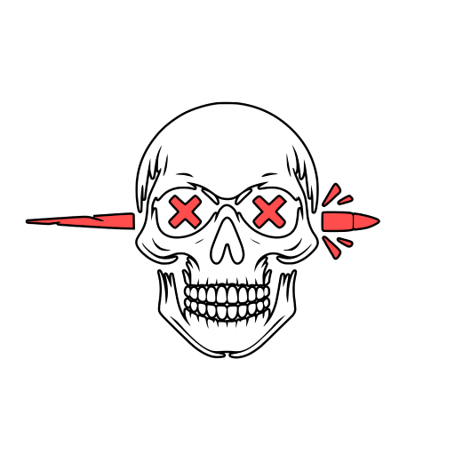
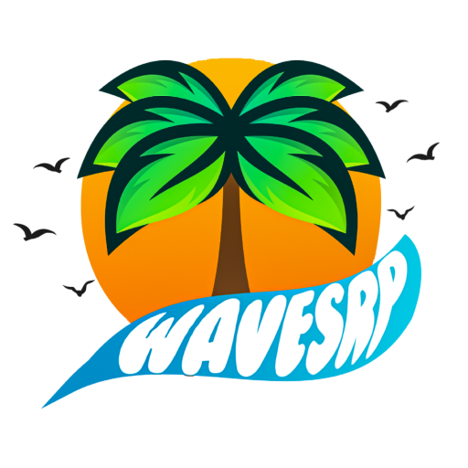

# XariiDev

🌐 - **Professional Bot Developer**

💵 - 7 **Satisfied Customers**

📞 - **Contact me on Discord:** xarii808

## Languages
 

## Frameworks 
 

## Big Projects i have worked for
### **ShootGG** - Bot Developer | **[Discord](https://discord.gg/shootgg)** | **[Website](https://indrop.eu/s/shootgg)** |

 

  --------------------------------------------------

### **WavesRP** - Bot Developer | **[Discord](https://discord.gg/wavesrp)** | **[Website](https://indrop.eu/s/wavesrp)** |

<!--
**xariidev/xariidev** is a ✨ _special_ ✨ repository because its `README.md` (this file) appears on your GitHub profile.

Here are some ideas to get you started:

- 🔭 I’m currently working on ...
- 🌱 I’m currently learning ...
- 👯 I’m looking to collaborate on ...
- 🤔 I’m looking for help with ...
- 💬 Ask me about ...
- 📫 How to reach me: ...
- 😄 Pronouns: ...
- ⚡ Fun fact: ...
-->
